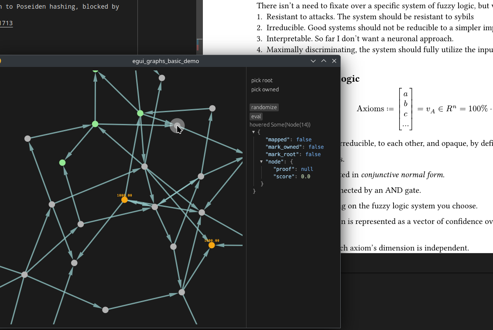

# Sparse merkle tree and other gadgets

A framework of reputation proofs in the setting of a distributed _internet_ protocol, conforming to my [notes](https://github.com/ple1n/awesome)

Code written for https://github.com/succinctlabs/sp1/

The runtime was chosen due to maturity and a probable migration to Poseiden hashing, blocked by

- https://github.com/succinctlabs/sp1/issues/2315#issue-3117741713

Other runtimes did not respond to my request.

Various components can interact to generate the final proof.

## Web of trust

There is an unfinished work of web-of-trust for which I wanted to use fuzzy logic. 

There is a component that implements interactive graph ui in pure Rust. 

Fuzzy logic might be more robust and interpretable, compared to eigenvector thing in linear algebra and neuronal methods. 